# Open Notebook — System Architecture

> Version 1.7.4 | February 2026

---

## Table of Contents

1. [System Overview](#system-overview)
2. [Three-Tier Architecture](#three-tier-architecture)
3. [Technology Stack](#technology-stack)
4. [API Layer](#api-layer)
5. [Domain Models](#domain-models)
6. [LangGraph Workflows](#langgraph-workflows)
7. [AI Provisioning](#ai-provisioning)
8. [Database Schema](#database-schema)
9. [Async Command Queue](#async-command-queue)
10. [Frontend Architecture](#frontend-architecture)
11. [Authentication & Security](#authentication--security)
12. [Error Handling](#error-handling)
13. [Deployment Architecture](#deployment-architecture)
14. [Data Flow Diagrams](#data-flow-diagrams)

---

## System Overview

Open Notebook is an open-source, privacy-focused AI research assistant. It allows users to ingest multi-modal content (PDFs, audio, video, web pages), generate intelligent notes, search semantically, chat with AI models, and produce professional podcasts — all self-hosted with full control over AI provider selection.

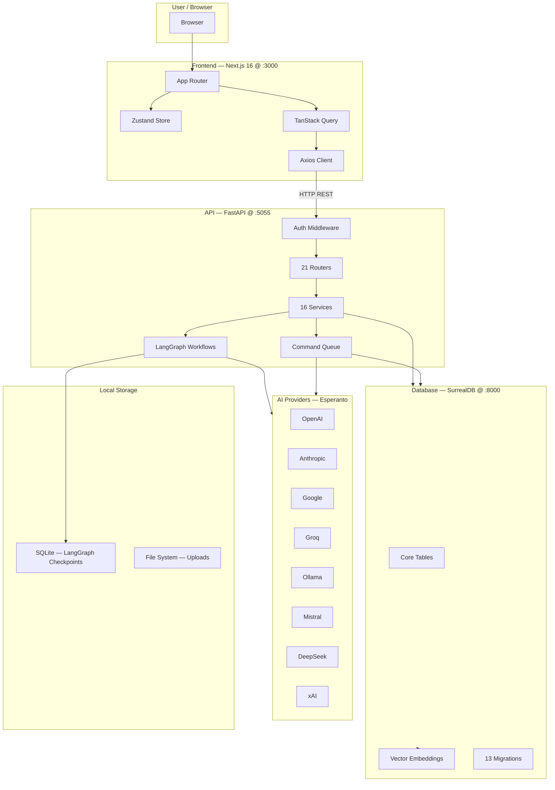

---

## Three-Tier Architecture

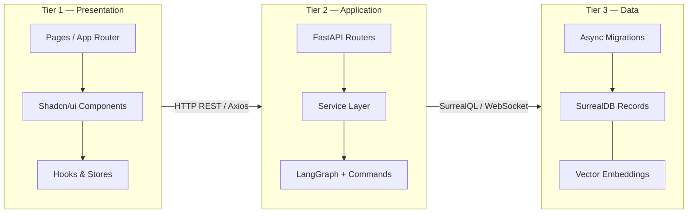

### Service Ports

| Service | Port | Protocol | Role |
|---------|------|----------|------|
| Next.js Frontend | **3000** | HTTP | React UI |
| FastAPI Backend | **5055** | HTTP/REST | API gateway |
| SurrealDB | **8000** | WebSocket/RPC | Graph database |

---

## Technology Stack

### Frontend (`frontend/`)

| Category | Technology | Version |
|----------|-----------|---------|
| Framework | Next.js (React 19) | 16.1.5 |
| Language | TypeScript | 5.x |
| State — Server | TanStack Query | 5.83 |
| State — Client | Zustand | 5.0.6 |
| HTTP Client | Axios | 1.13.5 |
| UI Components | Radix UI + Shadcn/ui | — |
| Styling | Tailwind CSS | 4.x |
| i18n | i18next | — |
| Locales | en-US, pt-BR, zh-CN, zh-TW, ja-JP | 5 |
| Testing | Vitest + Testing Library | — |

### API Backend (`api/` + `open_notebook/`)

| Category | Technology | Version |
|----------|-----------|---------|
| Framework | FastAPI + Uvicorn | 0.104+ |
| Language | Python | 3.11+ |
| Database Driver | SurrealDB async | 1.0.4+ |
| AI Providers | Esperanto | 2.19.3+ |
| Workflows | LangGraph | 1.0.5+ |
| Checkpoint Store | SqliteSaver | — |
| Content Processing | content-core | 1.14.1+ |
| Prompt Templates | AI-Prompter + Jinja2 | 0.3+ |
| Podcast Generation | podcast-creator | 0.11.2+ |
| Job Queue | surreal-commands | 1.3.1+ |
| Logging | Loguru | 0.7.2+ |
| Validation | Pydantic | v2 |
| Encryption | Fernet (AES-128-CBC + HMAC) | — |
| Testing | Pytest + pytest-asyncio | — |

---

## API Layer

### Router → Service Map (21 Routers / 16 Services)

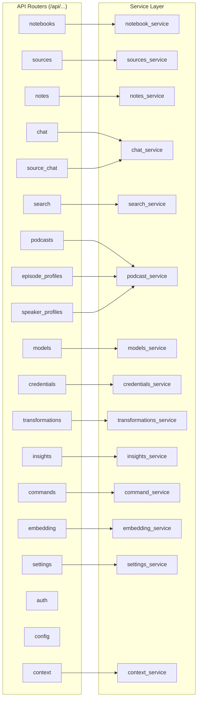

### Key API Endpoints

| Router | Endpoint | Method | Purpose |
|--------|----------|--------|---------|
| auth | `/api/auth/password` | POST | Authenticate, return token |
| notebooks | `/api/notebooks` | GET/POST | List / create notebooks |
| notebooks | `/api/notebooks/{id}` | GET/PUT/DELETE | Single notebook CRUD |
| sources | `/api/sources` | POST | Upload file / URL / text |
| sources | `/api/sources/{id}` | GET/PUT/DELETE | Single source CRUD |
| notes | `/api/notes/{id}` | GET/PUT/DELETE | Note CRUD |
| chat | `/api/chat` | POST | Send notebook chat message |
| source_chat | `/api/sources/{id}/chat` | POST | Chat with single source |
| search | `/api/search/ask` | POST | Multi-stage AI search |
| podcasts | `/api/podcasts` | GET/POST | Podcast management |
| models | `/api/models` | GET/POST | AI model registry |
| credentials | `/api/credentials` | GET/POST | Provider credentials |
| commands | `/api/commands/{id}` | GET | Poll async job status |
| embeddings | `/api/embeddings/rebuild` | POST | Trigger re-embedding |

---

## Domain Models

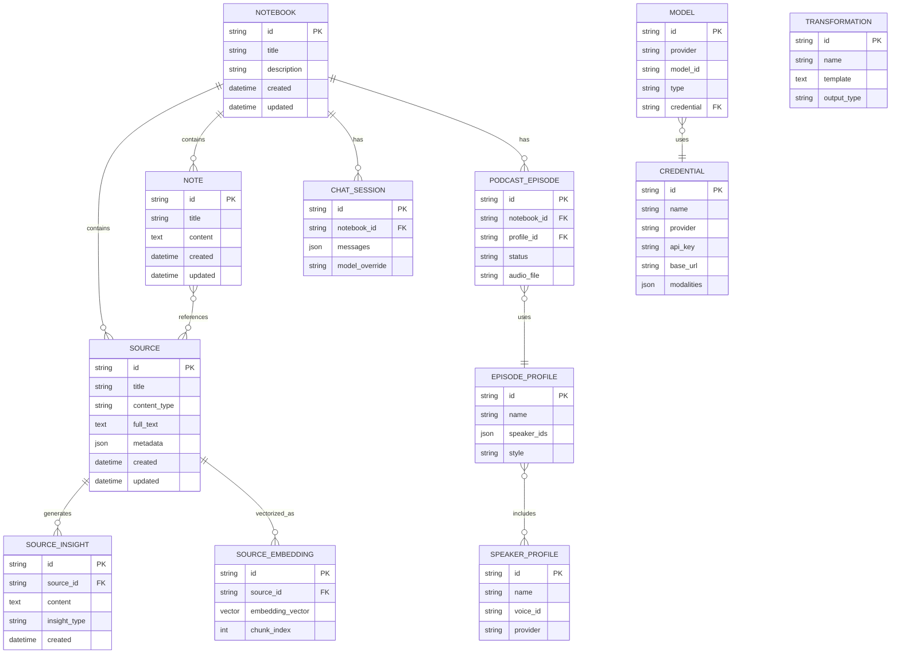

---

## LangGraph Workflows

Seven state machine workflows handle all AI-powered operations:

```mermaid
graph TD
    subgraph INGESTION["Source Ingestion — source.py"]
        I1([Start]) --> I2[Extract Content\ncontent-core]
        I2 --> I3[Save to SurrealDB]
        I3 --> I4[Chunk + Embed\nbatch embedding]
        I4 --> I5[Run Transformations]
        I5 --> I6([End])
    end

    subgraph CHAT["Notebook Chat — chat.py"]
        C1([Start]) --> C2[Load Message History\nSqliteSaver]
        C2 --> C3[Build System Prompt\nJinja2]
        C3 --> C4[LLM Invocation\nprovision_langchain_model]
        C4 --> C5[Persist Messages]
        C5 --> C6([End])
    end

    subgraph SRCCHAT["Source Chat — source_chat.py"]
        SC1([Start]) --> SC2[Fetch Source Context\ncontext_builder]
        SC2 --> SC3[Build Prompt with Context]
        SC3 --> SC4[LLM Invocation]
        SC4 --> SC5([End])
    end

    subgraph ASK["Search & Synthesis — ask.py"]
        A1([Start]) --> A2[Entry — Parse Query]
        A2 --> A3[Query × N\nParallel Searches]
        A3 --> A4[Retrieve Embeddings\nVector Search]
        A4 --> A5[Final Answer\nSynthesize Results]
        A5 --> A6([End])
    end

    subgraph TRANSFORM["Transformation — transformation.py"]
        T1([Start]) --> T2[Load Transformation Template]
        T2 --> T3[Render Jinja2 Template]
        T3 --> T4[LLM Invocation]
        T4 --> T5[Save Output as Note/Insight]
        T5 --> T6([End])
    end

    subgraph PODCAST["Podcast — via podcast-creator"]
        P1([Start]) --> P2[Load Episode Profile\n+ Speaker Profiles]
        P2 --> P3[Generate Outline\nLLM]
        P3 --> P4[Generate Transcript\nLLM]
        P4 --> P5[TTS Synthesis\nElevenLabs / other]
        P5 --> P6[Merge Audio]
        P6 --> P7([End])
    end
```

### Model Selection Logic

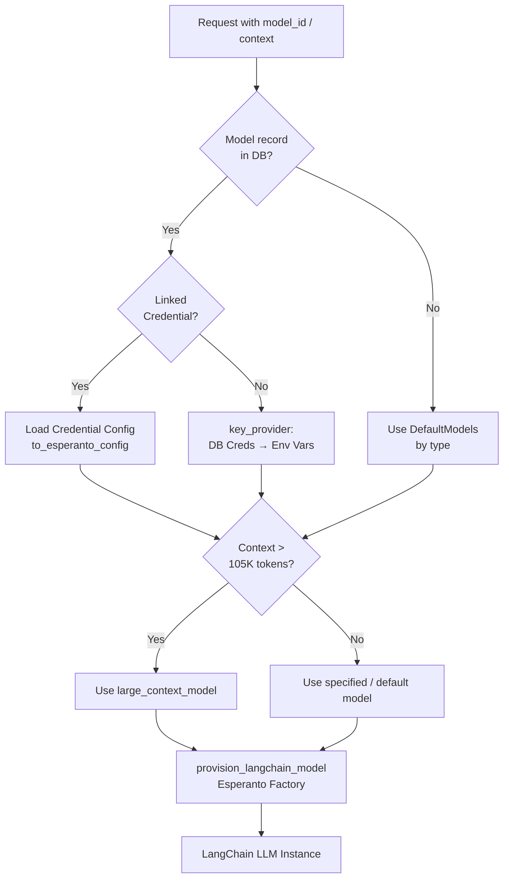

---

## AI Provisioning

### Supported Providers (Esperanto v2.19.3+)

| Provider | Chat | Embedding | TTS | Notes |
|----------|------|-----------|-----|-------|
| OpenAI | ✓ | ✓ | ✓ | GPT-4o, o3, etc. |
| Anthropic | ✓ | — | — | Claude 3.5/4.x |
| Google | ✓ | ✓ | — | Gemini Pro/Flash |
| Groq | ✓ | — | — | Fast inference |
| Ollama | ✓ | ✓ | — | Local models |
| Mistral | ✓ | ✓ | — | Mixtral |
| DeepSeek | ✓ | — | — | DeepSeek-R1 |
| xAI | ✓ | — | — | Grok |
| OpenRouter | ✓ | — | — | Meta-router |
| Azure OpenAI | ✓ | ✓ | — | Enterprise |
| Vertex AI | ✓ | ✓ | — | GCP |
| Voyage | — | ✓ | — | High-quality embeddings |
| ElevenLabs | — | — | ✓ | Podcast TTS |

### Credential Resolution Chain

```
Request → Model Record
            ↓
    Linked Credential?
    YES ──→ Credential.to_esperanto_config()
    NO  ──→ DB Credential Records (key_provider)
              ↓
        Environment Variables
              ↓
            Error
```

---

## Database Schema

### SurrealDB Migrations (13 versions)

| Migration | Purpose |
|-----------|---------|
| 1–3 | Core tables: notebooks, sources, notes |
| 4–6 | Relationships: source↔notebook, note↔source |
| 7 | Chat sessions + message history |
| 8–10 | Vector embeddings + semantic search indexes |
| 11 | Credential table + Fernet encryption |
| 12 | Model→Credential relationship |
| 13 | Additional model configuration fields |

### Vector Search Pattern

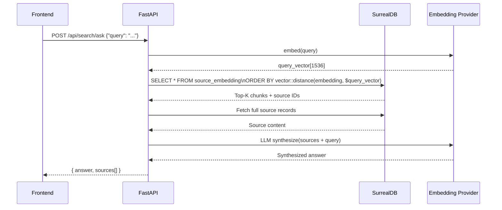

---

## Async Command Queue

All heavy operations run as fire-and-forget jobs:

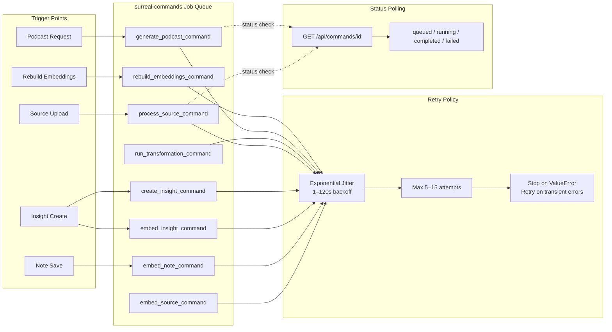

---

## Frontend Architecture

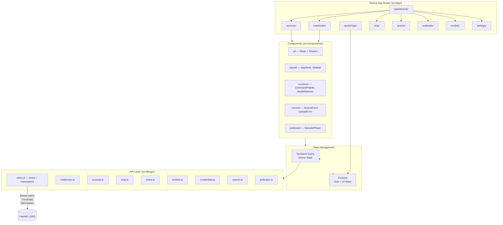

### State Management Pattern

| Layer | Technology | Scope | Persistence |
|-------|-----------|-------|-------------|
| Server data (notebooks, sources, notes) | TanStack Query | App-wide | In-memory cache |
| Auth (token, isAuthenticated) | Zustand + persist | App-wide | localStorage |
| UI state (modals, forms) | React useState | Component | In-memory |

---

## Authentication & Security

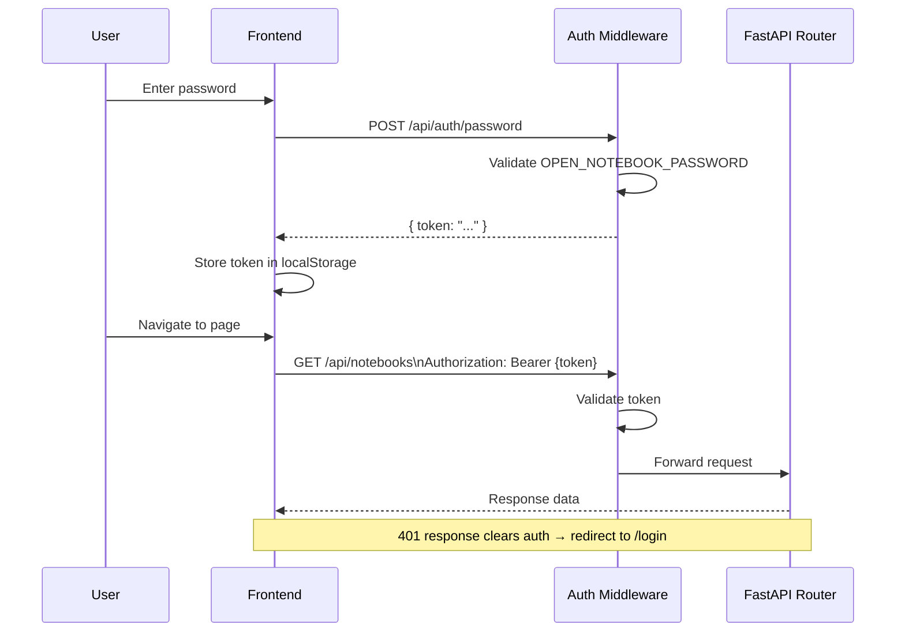

> **Production Warning**: `PasswordAuthMiddleware` is dev-only. Replace with OAuth2/JWT for production deployments.

### Credential Encryption

- **Algorithm**: Fernet (AES-128-CBC + HMAC-SHA256)
- **Key source**: `OPEN_NOTEBOOK_ENCRYPTION_KEY` environment variable
- **Scope**: All API keys stored in `Credential` records
- **At-rest**: Encrypted in SurrealDB; decrypted only on use

---

## Error Handling

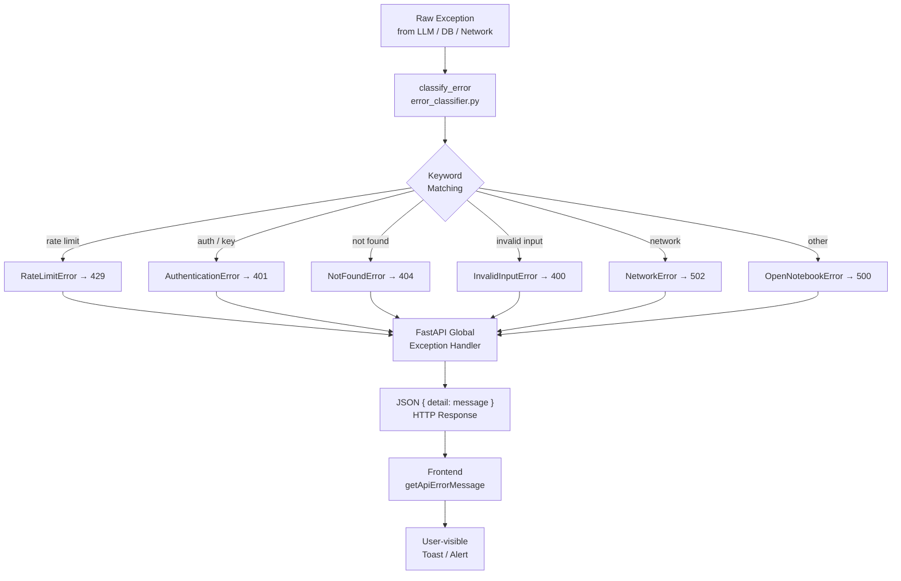

### Exception Hierarchy

```
OpenNotebookError (base)
├── NotFoundError              → HTTP 404
├── InvalidInputError          → HTTP 400
├── AuthenticationError        → HTTP 401
├── RateLimitError             → HTTP 429
├── ConfigurationError         → HTTP 422
├── NetworkError               → HTTP 502
└── ExternalServiceError       → HTTP 502
```

---

## Deployment Architecture

### Docker Compose Services

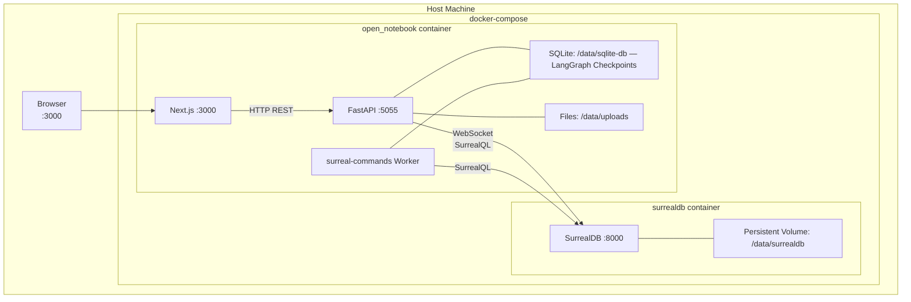

### Environment Variables (Key)

| Variable | Default | Purpose |
|----------|---------|---------|
| `SURREAL_URL` | `ws://localhost:8000/rpc` | SurrealDB WebSocket |
| `SURREAL_USER` | `root` | DB authentication |
| `SURREAL_PASSWORD` | `root` | DB authentication |
| `SURREAL_NAMESPACE` | `open_notebook` | DB namespace |
| `SURREAL_DATABASE` | `open_notebook` | DB name |
| `OPEN_NOTEBOOK_ENCRYPTION_KEY` | — | **Required** — Credential encryption |
| `OPEN_NOTEBOOK_PASSWORD` | `open-notebook-change-me` | API auth password |
| `OPEN_NOTEBOOK_CHUNK_SIZE` | `1200` | Embedding chunk size (chars) |
| `OPEN_NOTEBOOK_CHUNK_OVERLAP` | `180` | Chunk overlap (chars) |

---

## Data Flow Diagrams

### Source Ingestion Flow

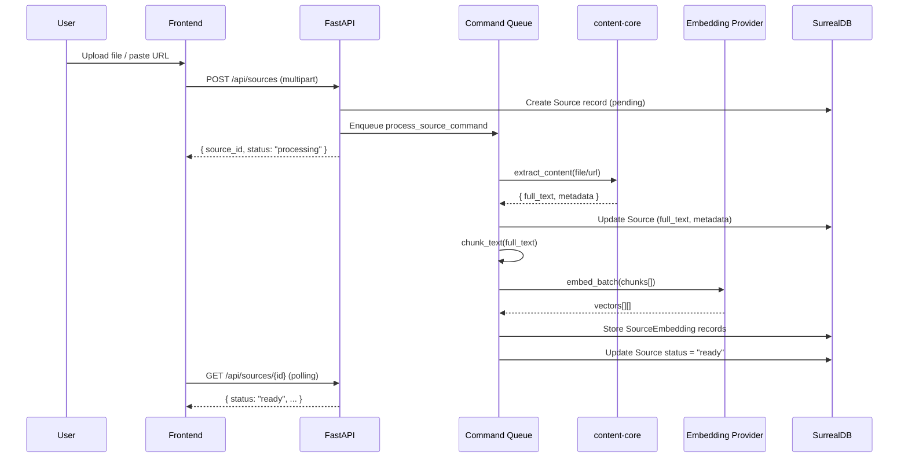

### Chat Message Flow

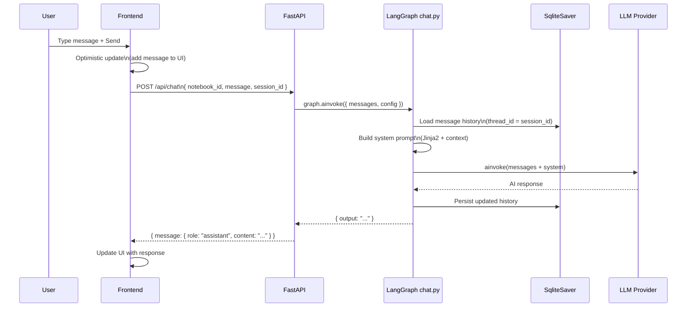

### Semantic Search Flow

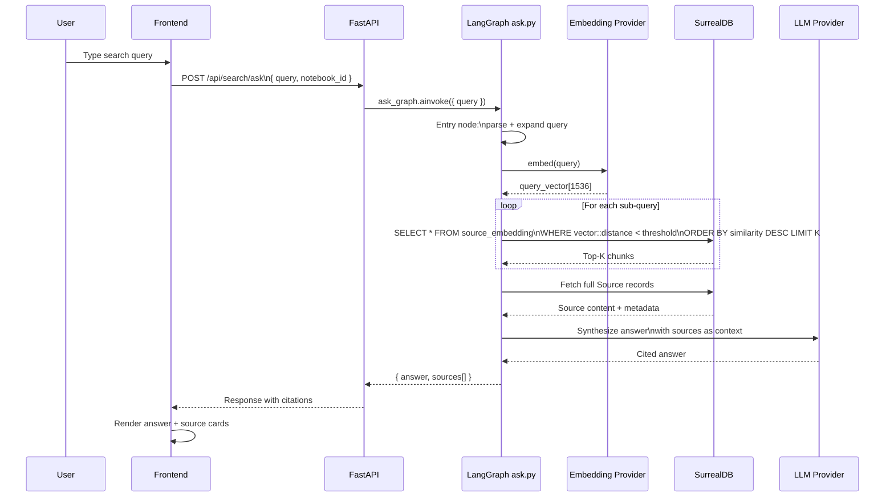

---

## Key Architectural Patterns

| Pattern | Where Used | Why |
|---------|-----------|-----|
| **Async-first** | All DB, graph, and API ops | Throughput under concurrent requests |
| **Fire-and-forget jobs** | Embeddings, podcasts, transformations | Non-blocking API responses |
| **Repository pattern** | `open_notebook/database/repository.py` | Single source for DB operations |
| **Polymorphic model resolution** | `ObjectModel.get(id)` | Resolve subclass from ID prefix |
| **Singleton config** | `RecordModel` for settings | Application-wide defaults |
| **Credential fallback chain** | `key_provider.py` | DB creds → Env vars → Error |
| **Error classification** | `error_classifier.py` | User-friendly exception messages |
| **State persistence** | SqliteSaver (SQLite) | LangGraph message history |
| **Token budgeting** | `context_builder.py` | Respect LLM context windows |
| **Optimistic updates** | Frontend chat hooks | Perceived performance |
| **Broad cache invalidation** | TanStack Query | Simplicity over precision |

---

## File Structure Summary
Why per-folder?
Each layer has genuinely different rules:

Folder	What its CLAUDE.md covers
open_notebook/ai/	How ModelManager works, Esperanto usage
open_notebook/graphs/	LangGraph node/edge patterns, async rules
open_notebook/database/	SurrealQL syntax, migration authoring
open_notebook/domain/	Repository pattern, model conventions
frontend/	React patterns, TanStack Query cache rules, i18n requirement
A CLAUDE.md at the root would be too generic to be useful in deep subdirectories, and too long to load efficiently.

The hierarchy

CLAUDE.md                  ← project-wide overview (you always get this)
├── api/CLAUDE.md          ← loaded when working in api/
├── frontend/CLAUDE.md     ← loaded when working in frontend/
└── open_notebook/
    ├── CLAUDE.md          ← loaded for any open_notebook/ work
    ├── ai/CLAUDE.md       ← loaded only when in ai/
    └── graphs/CLAUDE.md   ← loaded only when in graphs/
    
```
open-notebook/
├── api/                          # FastAPI backend (42 Python files)
│   ├── main.py                   # App, CORS, auth, exception handlers
│   ├── routers/                  # 21 endpoint routers
│   └── *_service.py              # 16 business logic services
├── open_notebook/                # Core library (38 Python files)
│   ├── domain/                   # Data models + repository
│   ├── database/                 # SurrealDB driver + migrations (13)
│   ├── ai/                       # ModelManager + Esperanto provisioning
│   ├── graphs/                   # 7 LangGraph workflows
│   ├── podcasts/                 # Podcast domain models
│   └── utils/                    # Context building, chunking, embedding
├── commands/                     # 8 async job handlers
├── prompts/                      # Jinja2 prompt templates
├── frontend/                     # Next.js 16 (193 TS/TSX files)
│   └── src/
│       ├── app/                  # App Router pages (auth + dashboard)
│       ├── components/           # UI components
│       └── lib/                  # API client, hooks, stores, i18n
├── tests/                        # Pytest test suite
├── docs/                         # User & deployment documentation
└── docker-compose.yml            # Local development stack
```

---

*Generated: February 2026 | Open Notebook v1.7.4 | MIT License*
